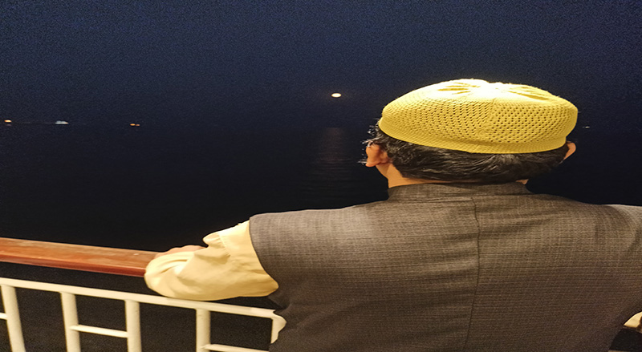

# Hello! This is  Mostafa Kamal

 
-----------------------------------------------------
Leaving: Dhaka, Bangladesh
### Introduction
Hello, I'm Mostafa Kamal. It's a pleasure to meet you all.
**Background:** I hold a master's degree from City University, specializing in Finance and Banking. Currently, I serve as a computer instructor at South Point School & College.

**Interests:** My passion lies in coding and web development. I find great joy in learning new programming languages and exploring the dynamic world of web development.

**Closing:** Thank you for the opportunity to share a bit about myself. I'm excited about the journey ahead and eager to continue growing and learning in the field of web development.

## My Skill:
- Basic HTML
- Basic CSS
-  Basics JavaScript
## Other Skill:
- MS Word
- MS Excel
- MS PowerPoint
- MS Access
- Basic Photoshop
## Emplyee History:
|Name of the Insittue|designation|Service Year|
|--------------------|-----------|---------------|
|South Point School & College|Computer Instructor|About 12 years|

## Education:
1. Master of Business Adminstration (MBA)

   City University
2. BSS

   Open University

## Language
- Bangla
- Englsih

## Hobies
- Reading
- Coding
- Learning

